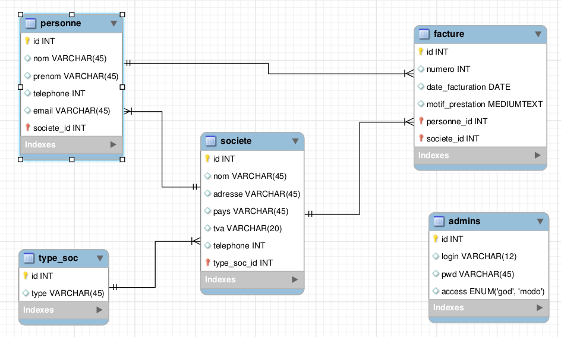

# Application comptable de la COGIP
- **Repository** : `COGIP-app`
- **Temps nécessaire** : 5 jours ouvrables
- **Deadline** : mardi 04/09 à 17:00
- **Contexte** : Exercice de groupe réalisé durant notre formation en developpeur web au sein de [BeCode](https://github.com/becodeorg/)

## Description du projet
 Réalisation d'une _web application_ permettant à notre client fictif de gérer la comptabilité de son entreprise.

 Celle-ci répond à un certain nombre d'objectifs:

 #### Objectifs d'évaluation
- Utiliser des paramètres URL et des noms de fichiers différents (l'application est structurée de manière à utiliser un router et de manière à séparer autant que possible le calcul de l'affichage. C'est à dire : le moins de PHP possible dans les templates, juste boucle et commandes d'affichage tels que echo).
- Bien utiliser la sanitization pour éviter les injections SQL dans votre DB (un esprit malveillant pourrait tenter de delete l'intégralité de votre DB)
- Valider les données afin que Ranu n'encode pas n'importe quoi
- Contruire une base de données relationnelles fonctionnelle
- Utiliser des jointures correctes en SQL
- Utiliser des alias dans vos requêtes SQL
- Implémenter un CRUD :
   - réaliser une interface qui permette de lire des données
   - réaliser une interface qui permette d'ajouter des données
   - réaliser une interface qui permette de modifier des données
   - réaliser une interface qui permette de supprimer des données
- Déployer l'application sur un hébergement adapté; l'application est fonctionnelle (les CRUD fonctionnent)
- Prévoir les erreurs dans le formulaire (maladresses ou tentatives d'injection SQL) : les messages d'erreurs s'affichent à proximité du champ concerné.

#### Objectifs d'apprentissage
- Crypter le mot de passe dans la base de données (il ne doit pas apparaître en clair)
- Utiliser la structure MVC pour ranger vos fichiers et vos fonctionnalités
- Utiliser un routeur
- Savoir mettre en place une session
- Permettre ou non l'accès à certaines pages en fonction des permissions de session

## Composition de l'équipe :
- [Eric Lavachery](https://github.com/ericLavachery)
- [Geraldine Winand](https://github.com/Geraldinew04)
- [Jesse Fumba](https://github.com/JFumba)

## Répartition des tâches :
Nous avons choisi de nous répartir le travail de la manière suivante:
- [Eric Lavachery](https://github.com/ericLavachery) s'est chargé de la partie _"société"_ ainsi que de
  la confection du *router*, de la structure _MVC_, l'élaboration et le suivi du *Kanban* et le déploiement
- [Geraldine Winand](https://github.com/Geraldinew04) de la partie _"contact"_ et du *design*
- [Jesse Fumba](https://github.com/JFumba) de ce qui concerne la partie _"facture"_, du *README* et d'une  partie du _design_.

Bien qu'ayant chacun nos tâches propres, nous nous sommes entraidés et nous avons communiqué tout au long du challenge, de sorte que celui-ci soit un tout cohérent.

## schéma visuel de la base de données relationnelle :

## Fichier sql :

[fichier_sql](db/id6935654_cogip.sql)

## URL du site consultable et fonctionnel :
